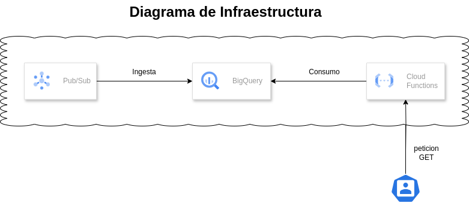
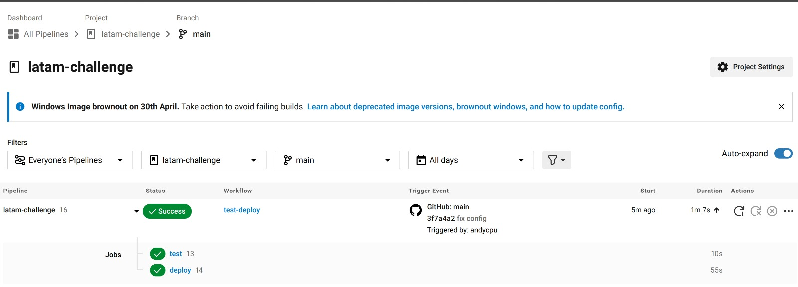

# latam-challenge

## Parte 1 - Infraestructura e IaC
Utilizacion de servicios en GCP
- Pub/Sub
- BigQuery como DB (por su enfoque en analítica de datos)
- Cloud Function (en Python) que expone datos de BQ mediante un endpoint HTTP al recibir una peticion GET

Deployment de infra a traves de terraform

## Parte 2 - Aplicaciones y flujo CI/CD
- API HTTP endpoint que muestra ya sea todos los vuelos o los vuelos desde una ciudad origen. Ejemplos: 
    - https://southamerica-west1-latam-challenge-421420.cloudfunctions.net/get_flights
    - https://southamerica-west1-latam-challenge-421420.cloudfunctions.net/get_flights?departure_city=Chicago

- Deployment de la Cloud Function con circleci
Uso de una SA (service account) definida en terraform para hacer el deployment.
Mejoras:
    - Una mejora que se propone aca seria usar "Workload Identity Federation" en vez de keys para la autenticacion de la SA.
    - Otra seria que el deployment automatico se realice solo cuando haya cambios relevantes a la API. No cualquier commit.

- Datos ingresados a BQ manualmente a traves de GCP console para simplificar. Lo ideal seria configurar la tabla para que tome los datos de pub sub directamente (o de otra fuente).

Nota: Pub/Sub no esta implementado

## Parte 3 - Pruebas de Integración y Puntos Críticos de Calidad

Se implementaron 2 tests que se ejecutan dentro del flujo CI/CD en circleci. 

Nota: se modifico el flujo CI/CD para que el deployment de la Cloud Function suceda solo si los test pasan

## Parte 4 - Métricas y Monitoreo